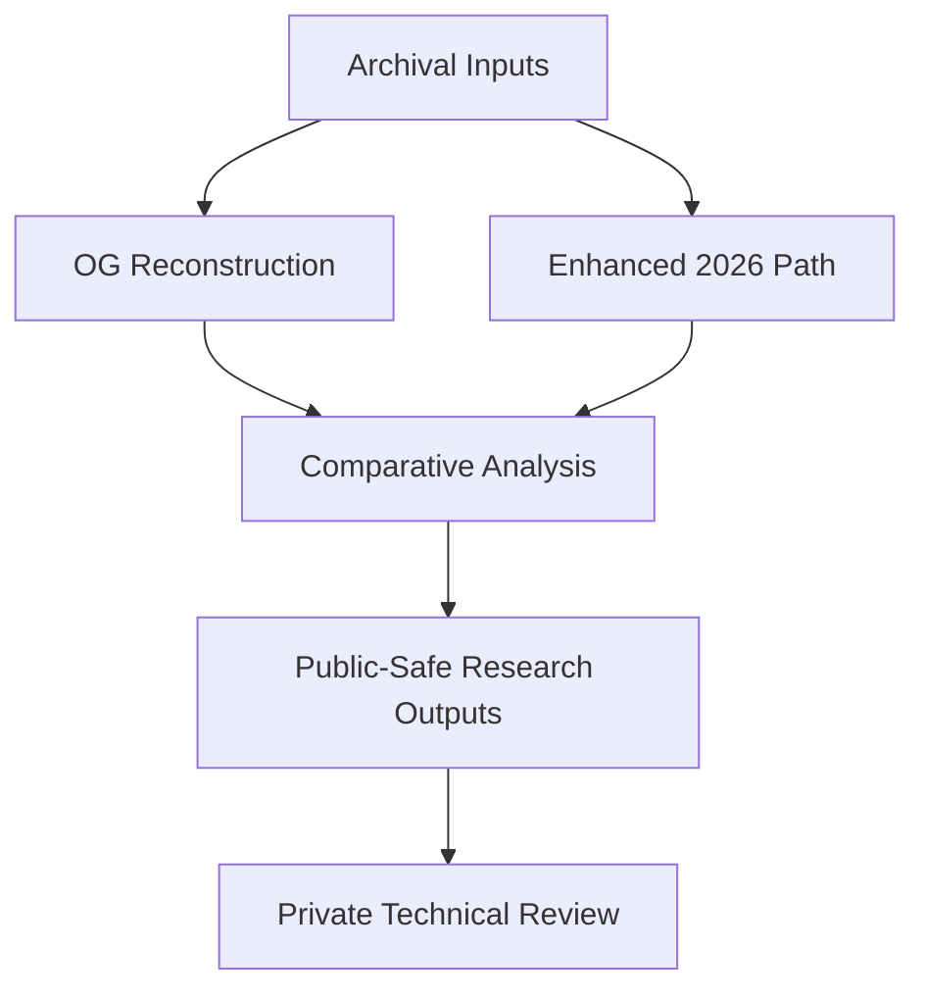

# Architecture (Public-Safe)

## Directory-level roles
- `ultrasound_whitepaper_refresh/og_reconstruction/`
  - Historical/protocol-faithful reconstruction track.
- `ultrasound_whitepaper_refresh/enhanced_2026/`
  - Safety-forward modernization track.
- `ultrasound_whitepaper_refresh/research/`
  - Context docs, sourcing notes, and high-level regulatory orientation.

## Conceptual flow

## Scope note
This architecture description is intentionally non-operational and excludes implementation detail.
